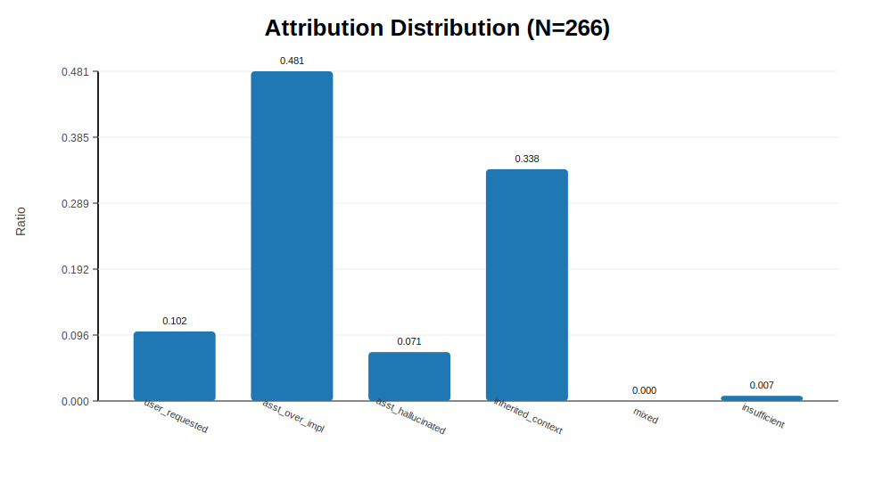
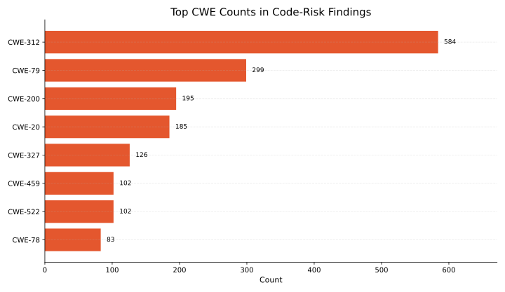
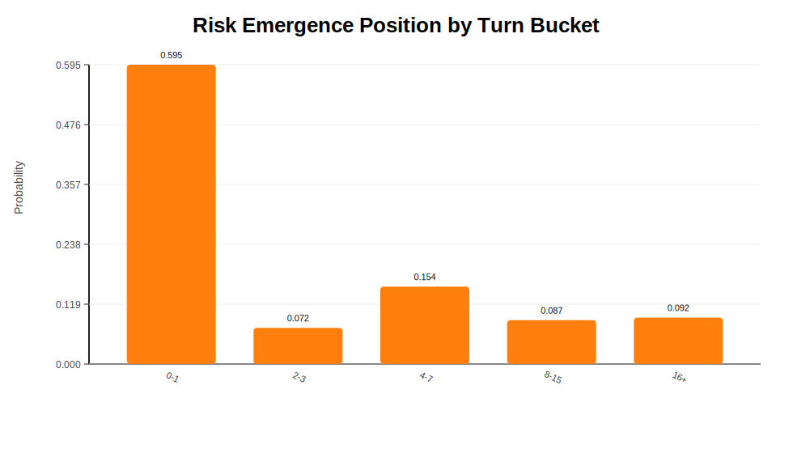
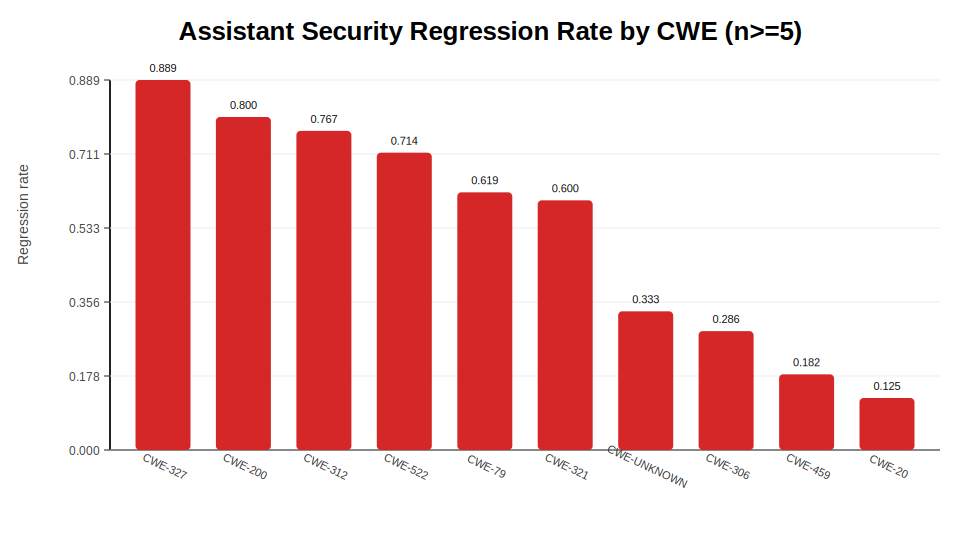

# Trajectory Causal Attribution of Security Risks in Vibe-Coding Conversations

## Abstract
This project studies how security risks emerge and evolve in assistant-generated coding conversations. We build a pipeline that starts from risky assistant outputs, traces conversational context, attributes root causes, and quantifies risk trajectories over turns. On 266 risky samples, we find that assistant-driven causes dominate (`55.26%` assistant-first vs `43.98%` user/context-first), with `assistant_over_implemented` as the largest attribution class (`48.12%`). Risk emergence is front-loaded (`59.49%` first appear at turn `0-1`) but escalation exhibits a long tail (mention-gap `p90=112`).

## 1. Method

### 1.1 Data and Processing Pipeline
We use conversation logs and metadata to build a multi-stage risk analysis pipeline:

1. Candidate extraction (`extract_candidates.py`): extract assistant outputs (code snippets, commands, security advice).
2. Risk judging (`judge_openrouter.py`): label risky vs non-risky findings and CWE tags.
3. Risk backtrace (`backtrace_risky_user_context.py`): map each risky finding to nearby user/assistant context.
4. Root-cause attribution (`judge_attribution_openrouter.py`): classify causal source.
5. Aggregation (`analyze_attribution_patterns.py` + `analyze_trajectory_metrics.py`): compute attribution and trajectory metrics.

### 1.2 Attribution Taxonomy
Each risky finding is labeled into one primary cause:

- `user_requested_risk`
- `assistant_over_implemented`
- `assistant_hallucinated_risk`
- `inherited_or_context_risk`
- `mixed_causality`
- `insufficient_evidence`

### 1.3 Trajectory Metrics
We compute four trajectory-oriented metrics:

1. Risk Emergence Position: `P(risk first appears at turn t)`.
2. Risk Escalation Depth: turn-gap statistics from first mention/concretization/persistence to final risky assistant turn.
3. User vs Assistant Initiation: who introduces insecure concept first (proxy from attribution labels).
4. Assistant Security Regression Rate: in assistant-driven cases, fraction where risk appears after an earlier non-final stage (`first_mention_turn < assistant_risk_turn`).

## 2. Results (Current)

### 2.1 Dataset Size
- Risky backtrace rows: `266`
- Attribution rows: `266`
- Joined analysis rows: `266`

### 2.2 Root-Cause Attribution Distribution
- `assistant_over_implemented`: `128/266` (`48.12%`)
- `inherited_or_context_risk`: `90/266` (`33.83%`)
- `user_requested_risk`: `27/266` (`10.15%`)
- `assistant_hallucinated_risk`: `19/266` (`7.14%`)
- `insufficient_evidence`: `2/266` (`0.75%`)
- `mixed_causality`: `0`

### 2.3 CWE Concentration
Top CWE categories in current risky set:

- `CWE-312`: `82`
- `CWE-79`: `45`
- `CWE-UNKNOWN`: `33`
- `CWE-459`: `22`
- `CWE-327`: `18`

### 2.4 Trajectory Findings
- Emergence coverage (has first mention): `195/266`
- Early emergence: `turn 0-1` accounts for `116/195` (`59.49%`)
- Escalation depth (median / p90):
  - mention gap: `8 / 112`
  - concretization gap: `14 / 98`
  - persistence gap: `23 / 102`

### 2.5 Initiation and Regression
- Assistant-first initiation (proxy): `147/266` (`55.26%`)
- User/context-first initiation (proxy): `117/266` (`43.98%`)
- Assistant security regression rate (proxy): `78/147` (`53.06%`)

Representative regression rates by CWE (`n>=5` assistant-driven cases):
- `CWE-327`: `0.8889`
- `CWE-200`: `0.8000`
- `CWE-312`: `0.7667`
- `CWE-522`: `0.7143`
- `CWE-79`: `0.6190`

## 3. Interpretation
Current evidence indicates that a large fraction of risky behavior is introduced or amplified by assistant decisions rather than explicit user requests. Risks also tend to appear early but can continue degrading across many turns, suggesting that safety controls should be enforced throughout multi-turn generation, not only on first response.

## 4. Threats to Validity
- Attribution and initiation are model-assisted labels; some categories may be prompt-sensitive.
- `CWE-UNKNOWN` remains non-trivial, limiting fine-grained security interpretation.
- Regression metric is proxy-based and should be complemented by human-annotated trajectory checkpoints.

## 5. Reproducibility
The numbers in this document are computed from:

- `analysis/output/attribution_analysis_all/summary.json`
- `analysis/output/attribution_analysis_all/cwe_attribution.csv`
- `analysis/output/trajectory_analysis_all/summary.json`
- `analysis/output/trajectory_analysis_all/assistant_regression_by_cwe.csv`

Figures are generated into tracked assets under:

- `paper_figures/fig1_attribution_distribution.svg`
- `paper_figures/fig2_top_cwe_counts.svg`
- `paper_figures/fig3_risk_emergence_bucket.svg`
- `paper_figures/fig4_regression_by_cwe.svg`
